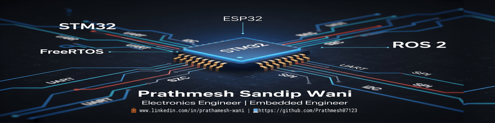

# 👋 Hi, I'm Prathamesh Wani

🎓 3rd Year Electronics & Telecommunication Engineering Student  
🛠️ Passionate about Embedded Systems, STM32, IoT, RTOS, and Real-Time Firmware Development  
📍 Based in India

---

## 🚀 About Me

I'm building a strong foundation in embedded systems through hands-on projects using STM32, ESP32, and real-time OS concepts. I enjoy working close to the hardware — from register-level programming to cloud-based IoT systems.

I'm currently:
- 🌱 Learning **FreeRTOS**, **micro-ROS**, and **bare-metal driver development**
- 🔧 Building a [mini project](https://github.com/prathmesh07123/MiniProject-Sem5-STM32-BareMetal) using **STM32L4P5ZG** with **register-level C**
- 📚 Following self-designed curriculums in drone design, soundcard electronics, and RTOS via Notion

---

## 📂 Projects & Logs

| Project | Description | Links |
|--------|-------------|--------|
| 🎓 Semester 5 Mini Project | Bare-metal LED blinking using STM32L4 (no HAL) | [GitHub](https://github.com/prathmesh07123/MiniProject-Sem5-STM32-BareMetal) • [Notion Log](https://www.notion.so/Mini-Project-Weekly-Log-Embedded-Systems-22fd5e68aa1780f4bacfd44b15a03610?source=copy_link) |
| 🤖 ROS 2 Mobile Robot | Autonomous navigation using camera and ultrasonic sensors | *(Coming soon)* |
| 🧠 RTOS Learning Repo | FreeRTOS task scheduling, queues, and semaphores on STM32 | *(Coming soon)* |
| 🔊 Soundcard Design | Research & simulate ADC/DAC circuits from scratch | *(In progress – see Notion)* |
| 🚁 70-Day Drone Curriculum | Full hands-on drone design with physics & code | *(In progress)* |

---

## 🧾 Notion Learning Space

I document all my weekly progress, research logs, and study curriculums in Notion.

🔗 [📘 Mini Project Weekly Log – Embedded Systems](https://www.notion.so/Mini-Project-Weekly-Log-Embedded-Systems-22fd5e68aa1780f4bacfd44b15a03610?source=copy_link)  
📦 ROS 2, Micro-ROS, RTOS, Drone Curriculum, Soundcard Design, and more

---

## 🛠 Technical Skills

**Languages:**  
C, Embedded C, C++, Python, Verilog

**Microcontrollers:**  
STM32 (L4, F1), ESP32, LPC2148, 8051, Raspberry Pi, Arduino

**Tools & IDEs:**  
STM32CubeIDE, Keil, Proteus, Arduino IDE, VS Code, PyCharm

**Protocols & Concepts:**  
UART, SPI, I2C, CAN, ADC/DAC, FreeRTOS, ThingSpeak, Git, Ethernet

**Other Tools:**  
DipTrace, Eagle, Fusion 360, Notion, MySQL

---

## 📊 GitHub Overview

---

## 🛠 Tools & Technologies

---

## 📫 Connect With Me

- 📧 Email: pwani090@gmail.com  
- 💼 [LinkedIn](https://linkedin.com/in/prathamesh-wani-263795322)  
- 📸 [Instagram](https://instagram.com/your_username)  
- 💻 [GitHub](https://github.com/prathmesh07123)

---

## 📜 License

MIT License – Educational & Open Source Contributions Welcome
